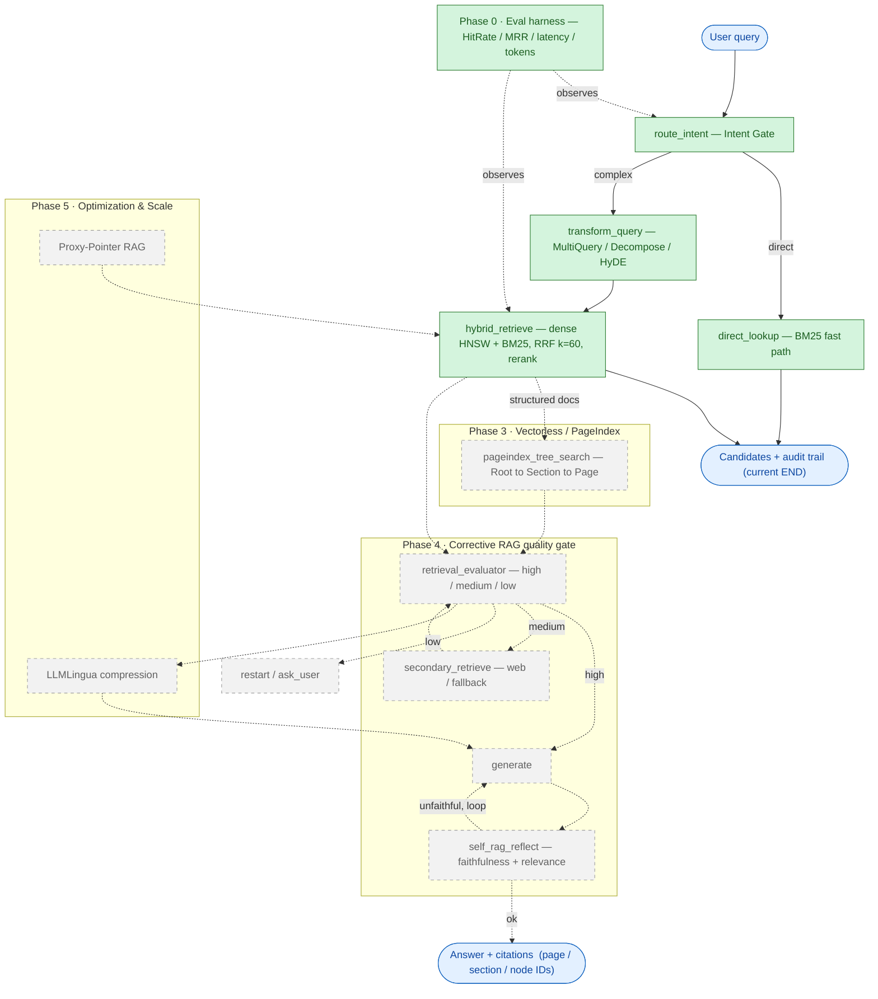

# Hydra — Architecture & Progress Map

The system is one LangGraph state machine over a shared `RAGState`. Solid arrows are the
**currently wired** flow; dashed arrows/nodes are **planned** (Phases 3–5). Colour marks
build status.

**Legend:** green = built & tested · grey dashed = planned · blue = input/output.

## Completion status

| Phase | Scope | Status |
|-------|-------|--------|
| **Phase 0** | Eval harness — HitRate/MRR/recall/precision@k, latency p50/p95, token accounting, CI gate | ✅ **Done** |
| **Phase 1** | `route_intent` (gate) + `transform_query` (Multi-Query / Decompose / HyDE) | ✅ **Done** |
| **Phase 2** | `hybrid_retrieve` (dense HNSW + BM25 → RRF k=60 → rerank) + `direct_lookup` | ✅ **Done** |
| **Phase 3** | `pageindex_tree_search` — vectorless tree reasoning | ⬜ Planned *(gated on §8 data-sovereignty decision)* |
| **Phase 4** | CRAG `retrieval_evaluator` + `generate` + `self_rag_reflect` cycle | ⬜ Planned |
| **Phase 5** | LLMLingua compression + Proxy-Pointer RAG | ⬜ Planned |

**We are here:** the graph runs end-to-end through **routing → query transformation →
hybrid retrieval**, returning ranked candidates with a page/section audit trail, all scored
by the Phase 0 harness. Everything past `hybrid_retrieve` (the dashed region) is not yet built —
the graph currently terminates at retrieved candidates; generation/citations arrive in Phase 4.
